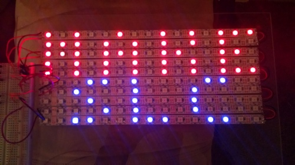
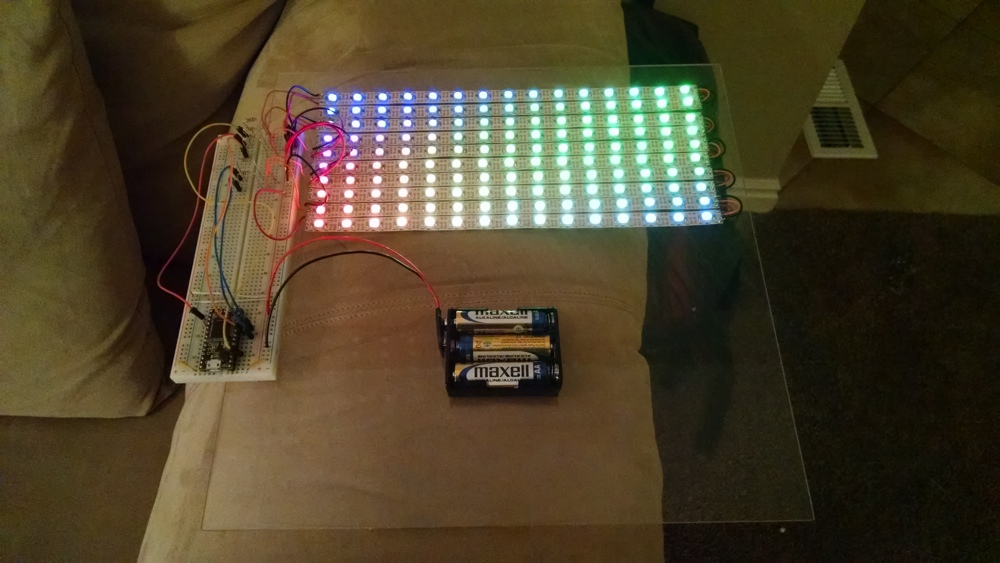

# LED MakeSLC

This shows a colorful LED light demo for [Make Salt Lake](http://makesaltlake.org). The LED strip is 15 lights across by 10 down, with each second line wrapping back to the beginning (e.g. each second line of LEDs is reversed).

- shows "MAKE SALT LAKE" scroll across
- shows a colorful SinWave demo
- shows "MAKE SLC" image
- shows several colorful wipe screens
- loops back to beginning

# Hardware

- [WS2811 60 pixel/m LED Strips](http://www.aliexpress.com/item/white-PCB-4m-DC5V-WS2811-IC-Built-in-WS2812-5050-RGB-60Pixel-m-Addressable-dream/1505832880.html)
- [Teensy 3.0 (or 3.1)](https://www.pjrc.com/store/teensy31.html)
- 3 AAA batteries
- some 100 Ohm resistors
- wires
- breadboard

# Dependencies

[OctoWS2811](http://www.pjrc.com/teensy/td_libs_OctoWS2811.html) Copyright (c) 2013 Paul Stoffregen, PJRC.COM, LLC
